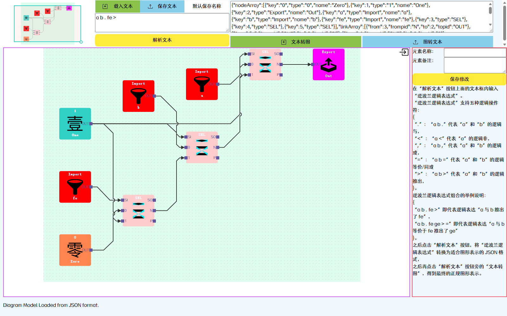
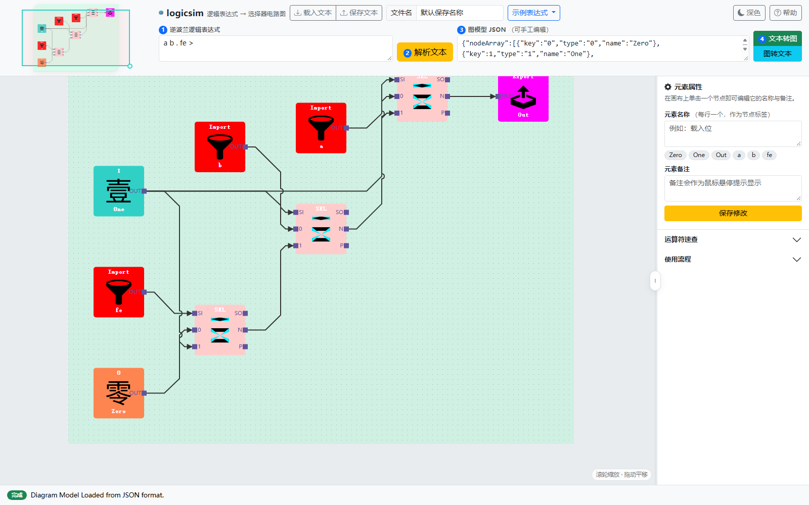
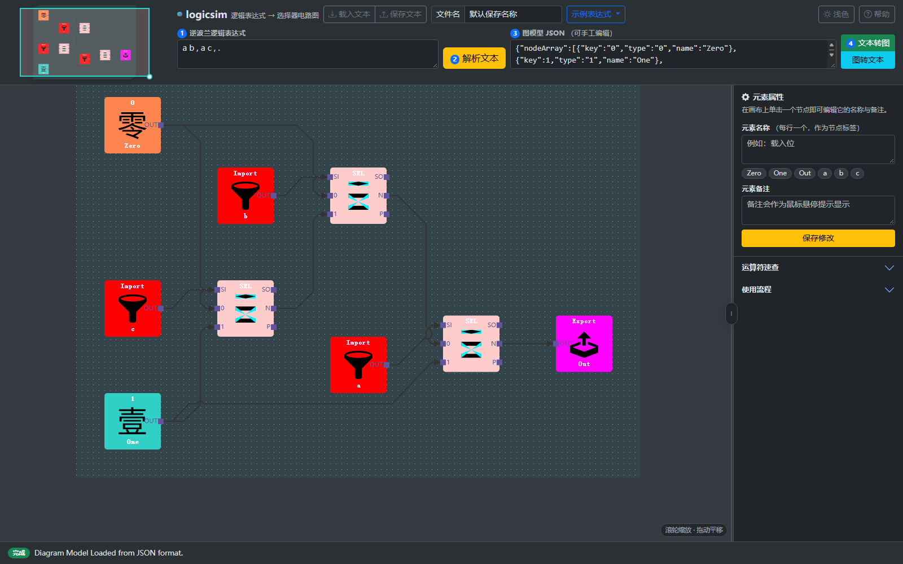
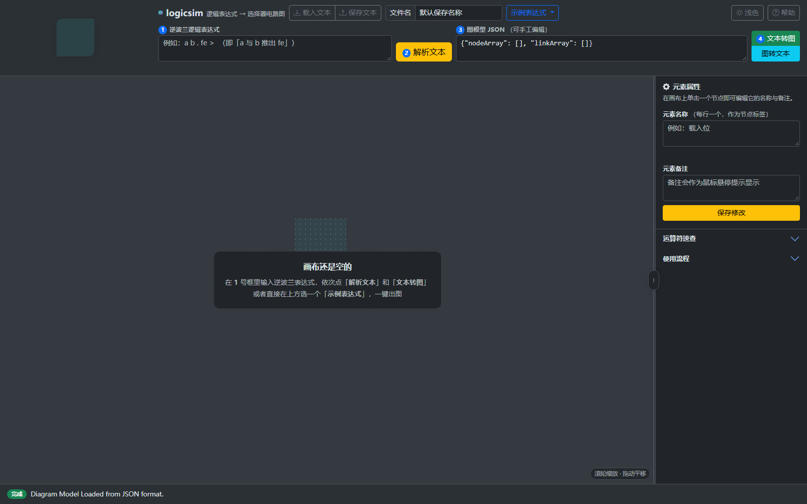

# logicsim

把**逆波兰（后缀）逻辑表达式**翻译成由**二选一选择器（MUX）**构成的判决网络图的纯前端小工具。

- 在线访问（GitLab Pages）：`<部署后填写>`
- 源码仓库：`<部署后填写>`

---

## 界面截图

| 改造前 | 改造后 · 浅色 | 改造后 · 深色 |
| --- | --- | --- |
|  |  |  |

画布为空时会给出操作引导（也可以直接点上方「示例表达式」一键出图）：



> 注：`docs/` 只用于项目说明，GitLab Pages 只发布 `public/` 目录，因此这些截图不会增加线上站点的体积。

---

## 一、功能说明

在「逆波兰逻辑表达式」文本框中输入表达式，点「解析文本」得到 JSON 图模型，再点「文本转图」即可得到电路图；「图转文本」可以反向导出。

「逆波兰逻辑表达式」支持五种逻辑操作符：

| 符号 | 写法 | 含义 |
| --- | --- | --- |
| `.` | `a b .` | `a` 和 `b` 的逻辑与 |
| `,` | `a b ,` | `a` 和 `b` 的逻辑或 |
| `<` | `a <` | `a` 的逻辑非 |
| `>` | `a b >` | `a` 和 `b` 的逻辑推出（蕴含） |
| `=` | `a b =` | `a` 和 `b` 的逻辑等价 / 同或 |

组合示例：

- `a b . fe >` 即「a 与 b 推出了 fe」；
- `a b . fe ge > =` 即「a 与 b 等价于 fe 推出了 ge」。

### 它画出来的是什么

不是门级电路图，而是**选择器判决网络**：依据香农展开

```
f = x' · f(x=0) + x · f(x=1)
```

每个变量对应一层 `SEL`（二选一选择器）节点，叶子是常量 `0` / `1`，最终汇入 `Export / Out`。

节点类型共 5 种：`0`、`1`、`Import`（变量入口）、`SEL`（选择器）、`Export`（输出）。
`SEL` 节点左侧是 `SI`（选择输入）与 `0` / `1`（两路数据输入），右侧是输出端口。

例如 `a b . fe >`（等价于 `¬a ∨ ¬b ∨ fe`）会生成 3 个 `SEL`、9 个节点、10 条连线。

### 主要操作

| 操作 | 说明 |
| --- | --- |
| 载入文本 / 保存文本 | 从本地 `.json` 文件读入或导出图模型 |
| 解析文本 | 后缀表达式 → 图模型 JSON |
| 文本转图 | 图模型 JSON → 画布图形 |
| 图转文本 | 画布图形 → 图模型 JSON |
| 示例表达式 | 内置几个例子，点一下直接出图 |
| 元素属性 | 单击画布上的节点后，编辑它的名称与备注 |
| 主题切换 | 深色 / 浅色，跟随系统偏好并可记忆 |

画布操作：滚轮以鼠标位置为中心缩放，拖动空白处平移，悬停节点出现删除按钮，右上角为迷你地图。

---

## 二、本地运行

**方式一（最简单）**：直接双击 `public/index.html` 用浏览器打开。

**方式二（推荐，避免个别浏览器对 `file://` 的限制）**：起一个静态服务器。

```bash
git clone <仓库地址>
cd logicsim
python -m http.server 8099 --directory public
# 浏览器打开 http://127.0.0.1:8099/
```

**不需要 `npm install`，不需要任何构建步骤**：所有第三方库都已内置在 `public/lib/`，页面不发出任何外部网络请求，可完全离线使用。

---

## 三、目录结构

```
logicsim/
├── .gitlab-ci.yml          # GitLab Pages 部署配置（把 public/ 作为产物发布）
├── README.md
└── public/                 # ← 部署根目录（GitLab Pages 约定）
    ├── index.html          # 页面结构
    ├── style.css           # 主题样式（Bootstrap 5 之上的自定义层）
    ├── ui.js               # 现代 UI 组件层（主题 / 提示 / 示例 / 快捷键）
    ├── LogicParser.js      # 算法层：表达式解析 + 判决图生成（纯函数，无 DOM 依赖）
    ├── ViewGen.js          # 绘图与交互层（JointJS）
    ├── latch.json          # 示例模型：由两个 SEL 交叉反馈构成的锁存器
    ├── assets/             # 节点图标（常量 0/1、输入、输出、SEL）
    └── lib/                # 内置第三方库
        ├── bootstrap.min.css / bootstrap.bundle.min.js   # Bootstrap 5.3.3
        ├── jquery.min.js / lodash.min.js / backbone.js   # JointJS 1.x 的运行依赖
        ├── graphlib.min.js / dagre.min.js                # 有向图分层布局
        ├── joint.js / joint.css                          # 绘图内核
        └── ...
```

### 数据流

```
后缀表达式
  │ LogicParser()   栈式求值 → 嵌套对象 {S, 0, 1}（香农展开树）
  │ ModelGen()      → { value: [判决行…], order: [变量顺序] }（含常量折叠）
  │ ViewGen()       → { nodeArray: […], linkArray: […] }（图模型 JSON）
  │ app.load()      → JointJS 渲染 + dagre 分层布局
  ▼
画布图形 ── app.save() / ELDump() ──▶ 图模型 JSON
```

---

## 四、本次界面改造说明

原项目使用 `w3.css` + `select2` 的老式界面层，本次将其升级为 **Bootstrap 5.3.3**（本地内置，保持离线可用）。绘图内核与算法层未做任何改动。

### 1. 界面组件现代化

- 用 Bootstrap 5 的按钮组、输入组、下拉菜单、折叠面板（Accordion）、模态框（Modal）、Toast 重构整个界面；
- 新增**深色 / 浅色主题**，默认跟随系统偏好并写入 `localStorage` 记忆；切换时同步重绘画布与迷你地图底色；
- 新增**示例表达式下拉菜单**，点击即填入并直接出图；
- 新增**状态提示**：底部状态徽标 + Toast 气泡，出错时自动变为红色；
- 新增**帮助弹窗**（Modal），集中放使用说明与快捷键；
- 新增**元素名称速填**：把当前模型里的元素名做成可点击的 chips，替代原先从未生效的 select2 下拉框；
- 新增快捷键：`Ctrl/Cmd + Enter` 解析并出图（原有 `Alt + ↑/↓` 缩放、`Alt + [ ]` 收起面板保留）。

### 2. 移除失效依赖与死资源（共约 2.1 MB）

| 移除项 | 原因 |
| --- | --- |
| `lib/select2.min.css` / `lib/select2.min.js` | 页面中并不存在被绑定的 `#sheet3` 元素，jQuery 对空集合静默无操作 —— select2 从未真正生效 |
| `lib/w3.css` | 已被 Bootstrap 5 取代 |
| `lib/joint.min.js` | 从未被 `index.html` 引用（页面加载的是 `joint.js`） |
| `lib/bootstrap.min.css` | 原为未被引用的旧版文件，现已替换为 Bootstrap 5.3.3 |
| `lib/TsangerYuYangT-W03.ttf`（1.6 MB） | 仅用于界面文字，已改为系统字体栈，中文字体交给系统渲染 |
| `assets/Slogan.svg`、`assets/box-arrow-*.svg`、`assets/icons/*.svg` | 重构后不再被引用（图标改为内联 SVG） |

### 3. 修复的问题

- **布局高度溢出**：原 `.app-body` 高度写成 `calc(100% - 60px)` 而页头为 `150px`，导致页面整体溢出 90px 被 `overflow: hidden` 裁掉（底部状态栏只剩下 60px）。现改为 flex 纵向布局，不再依赖魔法数字。
- **元素改名破坏图 ↔ JSON 往返**：原实现靠 `attrs.label.text` 判断节点类型，用户一旦改名，`ELDump` 就会把显示标签误当成类型，导致「图转文本」结果损坏。现在节点类型单独存放在 `nodeType` 属性上，标签可以随意修改。
- **元素名称输入方式不合理**：原输入框要求填写 JSON 数组（如 `["载入位"]`）。现在改为「每行一个名称」，同时向下兼容旧的 JSON 数组格式。
- **备注不可见**：备注原本写进一个没有对应标记的属性里，界面上看不到。现在会写入节点的 SVG `<title>`，鼠标悬停即可查看。
- **无法选中文字**：原 `body { user-select: none }` 让输入框里的文字也无法选中，现仅对画布区域禁用选择。
- **深色模式下状态文字不可读**：`ViewGen.js` 会把状态文字写成行内 `black`，深色主题下已做覆盖修正。
- **首屏主题闪烁**：在 `<head>` 中加入一小段同步脚本，在首次绘制前就应用保存的主题。

### 4. 未改动的部分

- `LogicParser.js`（算法层）与 JointJS / dagre 绘图内核保持原样；
- 图模型 JSON 的字段与结构保持向后兼容，旧的 `.json` 模型文件仍可直接载入。

---

## 五、部署（GitLab Pages）

仓库根目录的 `.gitlab-ci.yml` 已配置好：CI 使用 `busybox`，不做任何构建，直接把 `public/` 作为产物发布到 GitLab Pages。

推送到默认分支后，访问 `https://<用户名>.gitlab.io/<项目名>/` 即可。

---

## 六、兼容性与已知问题

- 需要较新的浏览器（Bootstrap 5 不再支持 IE）；
- 主题默认跟随操作系统的深浅色设置，可手动切换，选择会被记忆；
- 输入格式对空格敏感：运算符必须按后缀顺序书写，缺少操作数时会提示 `Format Error: arguments less than needed`，该错误信息会作为状态提示显示在底部状态栏。
